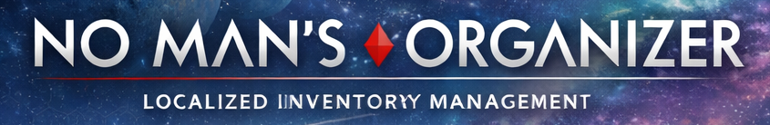

A local web app that organizes your No Man's Sky inventory across the 10 storage containers, freighter, and ships. Pick a layout, hit apply, the app rewrites your save with everything sorted into the chests you specified.

Reads/writes the same `save.hg` + `mf_save.hg` pair format that NomNom and the game itself use. Auto-backs up every save you load. Refuses to apply if anything looks wrong.

> ⚠ **Use at your own risk.** This tool only supports the **latest** No Man's Sky release. There has been no back-testing against older versions and there will not be. The save format changes between major NMS updates; if HelloGames ships a new version, assume this tool is broken until it's verified against the new format. Always keep a manual backup of any save you care about.

## Install

Requires [Node.js](https://nodejs.org/) (any LTS).

1. Download the [latest as a ZIP](https://github.com/cjcfojc/nms-organizer/archive/refs/heads/main.zip) and extract it. Or `git clone https://github.com/cjcfojc/nms-organizer.git`.
2. Double-click the launcher for your OS:
   - **Windows:** `start-windows-quiet.vbs` (recommended, no terminal window) or `start-windows.bat` (verbose terminal — better for debugging)
   - **macOS:** `start-macos.command` (right-click → Open the first time so Gatekeeper trusts it)
   - **Linux:** `./start-linux.sh` from a terminal
3. Your browser opens to `http://localhost:8765`. The setup wizard walks you through the rest.

Full details, screenshots, and per-tab usage guide on the [Wiki](https://github.com/cjcfojc/nms-organizer/wiki).

## What it does

- Reads your save (LZ4-compressed JSON wrapped in NMS chunks).
- Walks every inventory: 10 base storage containers, freighter inventory + cargo, all owned ships, exocrafts, exosuit, multi-tool.
- Classifies every item against a taxonomy extracted from MBIN game data — into 11 buckets (Raw — Common, Stellar Metals, Atmospheric, Exotic, Components, Curios, Cooking, Trade, Tech Modules, Salvage & Charts, Contraband).
- Lets you pick a layout — built-in presets like "The Vault" or your own — that maps each bucket to a chest.
- Generates a plan, validates it (no items destroyed, no positions out of bounds, no over-stacked slots), shows you a visual before/after diff per chest.
- On apply: rewrites the save bytes (preserving every C# float literal) and regenerates the encrypted manifest so NomNom and the game both accept it.
- Writes either: a download, a new slot in your NMS folder, or in-place over the original (with a typed-confirm modal and pre-overwrite backup).

## What it doesn't do

- **No cheats.** Doesn't add items, change amounts, edit currency, modify ships, or anything beyond moving existing inventory between containers.
- **No back-testing on older NMS versions.** Latest release only. If it loads a save it can't classify, items end up in "Uncategorized" and stay where they are.
- **No telemetry, no network calls, no accounts.** Runs entirely on `localhost`. Nothing leaves your machine.

## macOS / Linux notes

The core app — load, organize, apply — works on macOS and Linux out of the box. Two things require manual setup that the wizard does automatically on Windows:

- **NMS install path.** The wizard's Steam library scan is Windows-only. On macOS / Linux, type your NMS install path manually in the wizard's step 3.
  - Typical macOS path: `~/Library/Application Support/Steam/steamapps/common/No Man's Sky`
  - Typical Linux (Proton) path: `~/.local/share/Steam/steamapps/common/No Man's Sky`
- **Icon extraction.** Requires `hgpaktool.exe` and `tools/texconv.exe`, both of which are Windows binaries. On Linux you can run them via Wine; on macOS via Wine/Crossover (and on Apple Silicon you'll need Rosetta on top of that). Easiest path on either OS: skip the icons step. The app still functions, you just see colored category badges instead of game art.

Save folder auto-detection works on both macOS and Linux:
- macOS: `~/Library/Application Support/HelloGames/NMS/st_<steamid>/`
- Linux (Proton): `~/.local/share/Steam/steamapps/compatdata/275850/pfx/drive_c/users/steamuser/AppData/Roaming/HelloGames/NMS/st_<steamid>/`

## hgpaktool

`hgpaktool.exe` reads HelloGames' `.pak` archives. It's GPLv3, which means we can't bundle it without forcing this repo to GPL too — so the wizard asks you to point at one you have or download one. Two sources:

- **Easy path:** if you already use [AMUMSS](https://github.com/HolterPhylo/AMUMSS) for NMS modding, the tool ships with it at `MODBUILDER/hgpaktool.exe`. The wizard auto-detects common AMUMSS install drives.
- **Standalone:** [zencq/HGPak releases](https://github.com/zencq/HGPak/releases) — download the latest, drop the binary at `tools/hgpaktool.exe` in this repo, the wizard picks it up.

If you skip this step, the app still works — you just see colored category badges instead of item icons.

## How it works

Quick overview if you're poking around the code:

- `serve.js` — local Node HTTP server, no dependencies. Serves the static app, handles backups, manifest generation, and writes to your NMS folder.
- `app/lib/codec.js` — LZ4 block codec + the NMS chunk wrapper.
- `app/lib/payload.js` — custom JSON parser/serializer that preserves C# float formatting (`1.0` stays `1.0` — JavaScript's native `JSON.stringify` strips the `.0` and breaks the file).
- `app/lib/xxtea.js` — XXTEA cipher (libNOM variant) for the encrypted manifest file.
- `app/lib/manifest.js` — manifest generator using the "echo" strategy (decrypt the existing manifest, only update the three fields that changed, re-encrypt).
- `app/lib/save.js` — high-level save loader + structure walker.
- `app/lib/plan.js` — pure plan generator with hard invariants (input items === output items, every move accounted for).
- `app/lib/apply.js` — direct in-place mutation of the parsed save.
- `app/data/taxonomy.json` — 2,932 item records, derived from MBINCompiler.

Logs land in `logs/session.<timestamp>.<pid>.jsonl` — one structured event per line, both server and browser. If you hit a bug, attach that file to your report.

## Credits

- **Designed and built by [Claude Code](https://www.anthropic.com/claude-code) over a single multi-hour session.** [@cjcfojc](https://github.com/cjcfojc) directed the work, made the architectural calls, and tested every iteration. Every line of code went through their review.
- **Banner art** generated with Google Gemini and OpenAI ChatGPT.
- **Reverse-engineering ground truth** from [zencq's libNOM.io](https://github.com/zencq/libNOM.io) (the C# reference implementation used by NomNom). No code copied — just format documentation.
- **Item taxonomy + obfuscation map** derived from [monkeyman192's MBINCompiler](https://github.com/monkeyman192/MBINCompiler).
- **`texconv.exe`** ships from [Microsoft DirectXTex](https://github.com/microsoft/DirectXTex) under MIT.

## License

MIT. See [LICENSE](LICENSE) for details and the third-party component breakdown.
